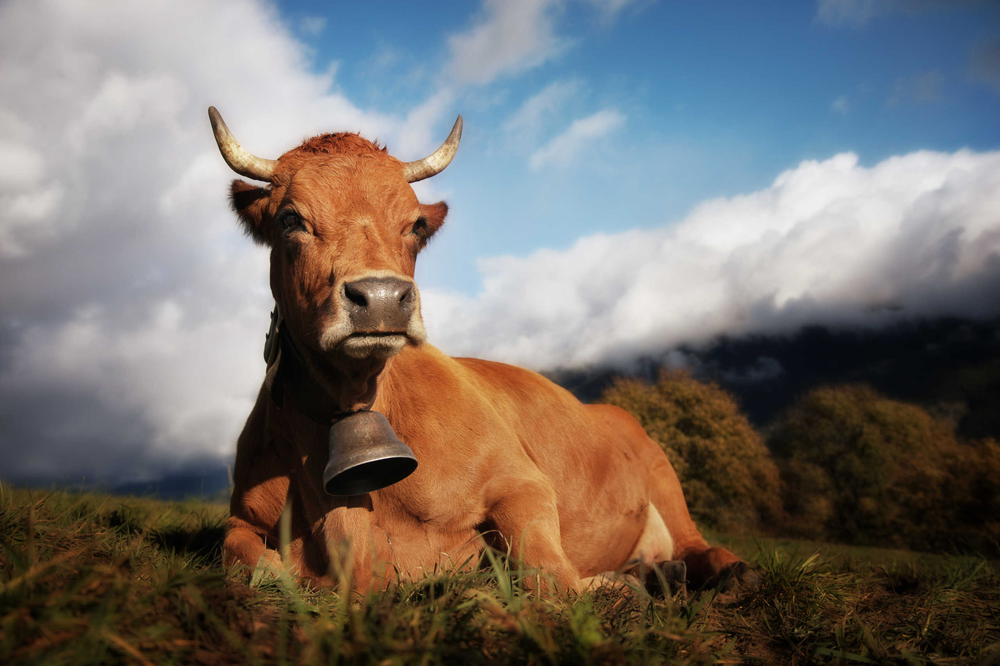

Demonstrations of Parazoom usage.

## Default

Here is the most simple usage.

{: .parazoom .default}

```

```

```
jQuery('img').parazoom();
```

Equivalent to the following default parameters:

```
jQuery('img').parazoom({
    scale: '1.2',
    transitionTime: '0.3s',
    transitionTimeLeave: '1s',
    opacity: '1',
    opacityHover: '1',
    overflow: 'hidden',
    cursor: 'default',
    customCursorIcon: '',
    customCursorSize: '20px',
    tilt: false,
    tiltXamount: 10,
    tiltYamount: 10,
    text: false,
    textClass: false,
    textPosition: 'middle',
    textAlignment: 'center',
    textXParallax: 10,
    textYParallax: 10,
    textOpacity: 0,
    textOpacityHover: 1
});
```

## Display alt text

Just add custom attribute `data-prz-text="true"` to display the alt text on hover.

{: .parazoom .default data-prz-text="true"}

```

```

Or add `text: true` in function call.

```
jQuery('img').parazoom({
    text: true
});
```

## Replace image on hover

Just add custom attribute `data-prz-large-img="url/of/another/image.jpg"` to display another image on mouse hover.

{: .parazoom .default data-prz-large-img="img/marmotte.jpg"}

```

```


```
jQuery('img').parazoom();
```

## Scale

Just add custom attribute with a number `data-prz-scale="0.5"` to set the transform scale effect on mouse hover.

{: .parazoom .default data-prz-scale="0.5"}

```

```

Or add `scale: '0.5'` in function call.

```
jQuery('img').parazoom({
    scale: '0.5'
});
```

## Transitions

Just add custom attributes with a CSS transition time values to set transition in and out durations. For example: `data-prz-transition-time="0.5s"` or `data-prz-transition-time="500ms"` is the same.

* `data-prz-transition-time` for transition duration on mouse enter
* `data-prz-transition-time-leave` for transition duration on mouse leave

{: .parazoom .default data-prz-transition-time="100ms" data-prz-transition-time-leave="3s"}

```

```

Or add `transitionTime: '100ms'` and `transitionTimeLeave: '3s'` as options object in function call.

```
jQuery('img').parazoom({
    transitionTime: '100ms',
    transitionTimeLeave: '3s'
});
```

## Overflow

Just add custom attributes with a CSS overflow value to enable or disable overflow `data-prz-overflow="visible"`.

{: .parazoom .default data-prz-overflow="visible"}

```

```

Or set it with Javascript.

```
jQuery('img').parazoom({
    overflow: 'visible'
});
```

## Tilt

Parazoom allows to add tilt effect on both X and Y axis. Just add custom attributes.

* `data-prz-tilt="true"` to enable tilt
* `data-prz-tilt-x-amount="30"` to set the X axis amount of tilt
* `data-prz-tilt-y-amount="20"` to set the Y axis amount of tilt

{: .parazoom .default data-prz-tilt="true" data-prz-overflow="visible" data-prz-tilt-x-amount="30" data-prz-tilt-y-amount="20" data-prz-overflow="visible"}

```

```

Or set it with Javascript.

```
jQuery('img').parazoom({
    tilt: true
    tiltXamount: '30'
    tiltYamount: '20'
    overflow: 'visible'
});
```

## Cursor

Change cursor on mouse hover by setting a CSS property via custom attributes `data-prz-cursor="pointer"` for example.

{: .parazoom .default data-prz-cursor="pointer"}

```

```

Or set it with Javascript.

```
jQuery('img').parazoom({
    cursor: 'pointer'
});
```

## Custom cursor

Add a custom cursor on mouse hover by setting an image resource URL via custom attributes `data-prz-cursor-icon="url/to/the/image-file.png"` and `data-prz-cursor-size="100px"`.

{: .parazoom .default data-prz-custom-cursor-icon="img/maximize.svg" data-prz-custom-cursor-size="100px"}

```

```

Or set it with Javascript.

```
jQuery('img').parazoom({
    customCursorIcon: 'img/pattern.png',
    customCursorSize: '100px'
});
```

## Text position

Display image alt text or custom text on mouse hover via custom attributes:
* `data-prz-text="true"` to enable
* `data-prz-text-position="bottom"` sets the vertical position top, middle or bottom
* `data-prz-text-alignment="right"` sets the horizontal position left, center or right

{: .parazoom .default data-prz-text="true" data-prz-text-position="bottom" data-prz-text-alignment="right" data-prz-overflow="visible"}

```

```

Or set it with Javascript.

```
jQuery('img').parazoom({
    text: true,
    textPosition: 'bottom',
    textAlignment: 'right',
    overflow: 'visible'
});
```

## Text customization

Text display comes into a `<div class="prz-text">` tag that can be customized in CSS to your needs. You can even set an additional CSS class for each Parazoom element.

* `data-prz-text="true"` to enable
* `data-prz-text-position="bottom"` sets the vertical position top, middle or bottom
* `data-prz-text-alignment="right"` sets the horizontal position left, center or right
* `data-prz-text-content="My custom content"` if set, display the entered text instead of alt text
* `data-prz-text-class="myCSSclass"` adds a custom CSS class to the text container
* `data-prz-text-x-parallax="30"` sets the amount of horizontal parallax
* `data-prz-text-y-parallax="30"` sets the amount of vertical parallax
* `data-prz-text-opacity="0.3"` sets the mouse out opacity
* `data-prz-text-opacity-hover="1"` sets the mouse hover opacity

<style>
.myCSSclass {
    background-color: rgba(244, 154, 26,.5);
    color: white;
    padding: 3em;
}
</style>
{: .parazoom .default data-prz-text="true" data-prz-text-content="My custom content" data-prz-text-position="bottom" data-prz-text-alignment="right" data-prz-text-class="myCSSclass" data-prz-text-x-parallax="30" data-prz-text-y-parallax="30" data-prz-text-opacity="0.3" data-prz-text-opacity-hover="1" data-prz-overflow="visible"}

```

```

Or set it with Javascript.

```
jQuery('img').parazoom({
    textClass: true,
    textPosition: 'bottom',
    textAlignment: 'right',
    textClass: 'myCSSclass',
    textXParallax: 30,
    textYParallax: 30,
    textOpacity: 0.3,
    textOpacityHover: 1,
    overflow: 'visible'
});
```

Here is the text CSS customization. For each Parazoom element, it renders

```
/* For default alt text display */
<div class="prz-text">Alt attribute text of the image</div>

/* For custom CSS class display */
<div class="prz-text">
    <div class="myCSSclass">
        Alt attribute text of the image
    </div>
</div>
```

In the example above, i have set the following CSS:
```
<style>
.myCSSclass {
    background-color: rgba(244, 154, 26,.5);
    color: white;
    padding: 3em;
}
</style>
```
